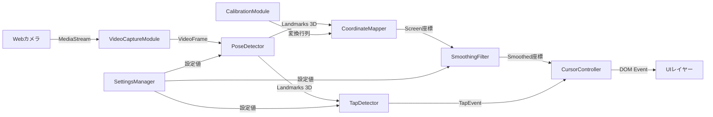
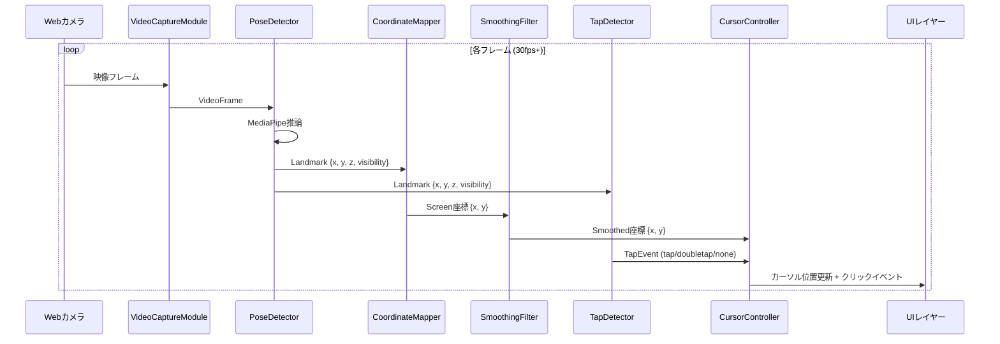

# 設計ドキュメント: Toe Cursor Control

## 概要 (Overview)

Toe Cursor Controlは、天井に設置したWebカメラで撮影した映像からユーザーの足のつま先をリアルタイムに検出し、Webアプリケーション上のカーソル操作およびクリック操作を実現するブラウザベースの入力システムである。

### 技術スタック

- **フロントエンド**: TypeScript + HTML5 Canvas
- **姿勢推定**: MediaPipe Pose Landmarker（ブラウザ向けJavaScript SDK）
- **映像取得**: MediaStream API (getUserMedia)
- **ビルドツール**: Vite
- **テスト**: Vitest + fast-check（プロパティベーステスト）

### 設計方針

1. **モジュラーアーキテクチャ**: 各機能を独立したモジュールとして設計し、テスト容易性と保守性を確保する
2. **パイプライン処理**: 映像フレーム → 姿勢推定 → 座標変換 → スムージング → カーソル更新の一方向データフロー
3. **設定の外部化**: タップ感度やスムージング強度などのパラメータを設定オブジェクトとして管理する
4. **純粋関数の分離**: 座標変換、スムージング、タップ検出のコアロジックを副作用のない純粋関数として実装し、テスト容易性を高める

### リサーチ結果

**MediaPipe Pose Landmarker**を姿勢推定エンジンとして採用する。理由は以下の通り:

- 33個のボディランドマークを検出可能で、足のつま先（左足つま先: index 31、右足つま先: index 32）を直接取得できる（[MediaPipe Pose Landmarker](https://ai.google.dev/edge/mediapipe/solutions/vision/pose_landmarker/web_js)）
- 3D座標（x, y, z）を出力するため、つま先の高さ（z座標）を利用したタップ検出が可能
- ブラウザ上でリアルタイム動作し、WebGLアクセラレーションに対応
- TensorFlow.js MoveNetは17キーポイントのみで足のつま先ランドマークが含まれないため不採用（[MoveNet README](https://github.com/tensorflow/tfjs-models/blob/master/pose-detection/src/movenet/README.md)）

**座標変換**にはホモグラフィ変換（射影変換）を採用する。キャリブレーション時に4点の対応関係から3x3の変換行列を算出し、カメラ空間からスクリーン空間への正確なマッピングを実現する。

**スムージング**には指数移動平均（EMA）を採用する。`smoothed = α * current + (1 - α) * previous`の式で、αの値（0〜1）でスムージング強度を制御する。低遅延と安定性のバランスが取れる手法である。

## アーキテクチャ (Architecture)

### システム全体のデータフロー



### 処理パイプライン



### モジュール構成

```
src/
├── index.html
├── main.ts                    # エントリーポイント
├── core/
│   ├── VideoCaptureModule.ts  # カメラ映像取得
│   ├── PoseDetector.ts        # MediaPipe姿勢推定
│   ├── CoordinateMapper.ts    # 座標変換（純粋関数）
│   ├── SmoothingFilter.ts     # EMAスムージング（純粋関数）
│   ├── TapDetector.ts         # タップ検出（純粋関数）
│   └── CursorController.ts   # カーソル制御・イベント発火
├── calibration/
│   ├── CalibrationModule.ts   # キャリブレーション手順管理
│   └── HomographyMatrix.ts    # ホモグラフィ行列計算（純粋関数）
├── ui/
│   ├── CursorOverlay.ts       # カーソル表示
│   ├── StatusIndicator.ts     # 検出状態表示
│   ├── CameraPreview.ts       # カメラプレビュー
│   └── SettingsPanel.ts       # 設定パネル
├── config/
│   └── Settings.ts            # 設定管理
└── types/
    └── index.ts               # 型定義
```

## コンポーネントとインターフェース (Components and Interfaces)

### VideoCaptureModule

カメラ映像の取得と管理を担当する。

```typescript
interface VideoCaptureModule {
  /** カメラストリームを開始する */
  start(constraints?: MediaStreamConstraints): Promise<void>;
  /** カメラストリームを停止する */
  stop(): void;
  /** 現在のフレームを取得する */
  getCurrentFrame(): HTMLVideoElement | null;
  /** フレーム更新時のコールバックを登録する */
  onFrame(callback: (video: HTMLVideoElement) => void): void;
  /** カメラの状態を取得する */
  getStatus(): CameraStatus;
}

type CameraStatus = 'idle' | 'requesting' | 'active' | 'denied' | 'not_found' | 'error';
```

### PoseDetector

MediaPipe Pose Landmarkerをラップし、つま先のランドマークを抽出する。

```typescript
interface PoseDetector {
  /** モデルを初期化する */
  initialize(): Promise<void>;
  /** フレームからつま先位置を検出する */
  detect(video: HTMLVideoElement): Promise<ToeDetectionResult>;
  /** 検出対象の足を設定する */
  setTargetFoot(foot: 'left' | 'right'): void;
  /** リソースを解放する */
  dispose(): void;
}

interface ToeDetectionResult {
  /** 検出されたつま先の位置（Camera Space） */
  position: Point3D | null;
  /** 検出の信頼度 (0-1) */
  confidence: number;
  /** 検出状態 */
  detected: boolean;
  /** タイムスタンプ (ms) */
  timestamp: number;
}

interface Point3D {
  x: number;  // 0-1 正規化座標
  y: number;  // 0-1 正規化座標
  z: number;  // 深度（相対値）
}
```

### CoordinateMapper

カメラ空間座標をスクリーン空間座標に変換する純粋関数モジュール。

```typescript
interface CoordinateMapper {
  /** キャリブレーションデータを設定する */
  setCalibration(matrix: HomographyMatrix): void;
  /** Camera Space座標をScreen Space座標に変換する */
  mapToScreen(point: Point2D, screenSize: ScreenSize): Point2D;
  /** キャリブレーション済みかどうか */
  isCalibrated(): boolean;
}

/** ホモグラフィ変換の純粋関数 */
function applyHomography(matrix: number[], point: Point2D): Point2D;

/** 4点の対応からホモグラフィ行列を計算する純粋関数 */
function computeHomography(
  srcPoints: [Point2D, Point2D, Point2D, Point2D],
  dstPoints: [Point2D, Point2D, Point2D, Point2D]
): number[];
```

### SmoothingFilter

EMA（指数移動平均）によるスムージング処理。

```typescript
/** EMAスムージングの純粋関数 */
function applyEMA(
  current: Point2D,
  previous: Point2D,
  alpha: number
): Point2D;

/** デッドゾーン付きスムージング */
function applySmoothing(
  current: Point2D,
  previous: Point2D,
  config: SmoothingConfig
): Point2D;

interface SmoothingConfig {
  /** EMAの平滑化係数 (0-1, 高いほど追従性が高い) */
  alpha: number;
  /** デッドゾーン半径（px）: この範囲内の微小移動を無視 */
  deadZone: number;
}
```

### TapDetector

つま先のz座標の変化からタップ動作を検出する。

```typescript
/** タップ検出の純粋関数 */
function detectTap(
  history: ToeFrame[],
  config: TapConfig
): TapResult;

interface ToeFrame {
  z: number;         // つま先の高さ（z座標）
  timestamp: number; // タイムスタンプ (ms)
}

interface TapConfig {
  /** タップと判定する下方向速度の閾値 */
  velocityThreshold: number;
  /** タップ後の無視期間 (ms) */
  cooldownMs: number;
  /** ダブルタップの最大間隔 (ms) */
  doubleTapWindowMs: number;
}

interface TapResult {
  /** 検出されたイベント */
  event: 'tap' | 'doubletap' | 'none';
  /** 最後のタップのタイムスタンプ */
  lastTapTimestamp: number | null;
}
```

### CursorController

カーソルの表示位置更新とクリックイベントの発火を担当する。

```typescript
interface CursorController {
  /** カーソル位置を更新する */
  updatePosition(position: Point2D): void;
  /** クリックイベントを発火する */
  emitClick(position: Point2D): void;
  /** ダブルクリックイベントを発火する */
  emitDoubleClick(position: Point2D): void;
  /** 現在のカーソル位置を取得する */
  getPosition(): Point2D;
}
```

### CalibrationModule

キャリブレーション手順を管理する。

```typescript
interface CalibrationModule {
  /** キャリブレーションを開始する */
  startCalibration(): void;
  /** キャリブレーションポイントを記録する */
  recordPoint(cameraPoint: Point2D, screenPoint: Point2D): void;
  /** キャリブレーションを完了し変換行列を算出する */
  complete(): HomographyMatrix | null;
  /** 保存済みキャリブレーションを読み込む */
  load(): HomographyMatrix | null;
  /** キャリブレーションデータを保存する */
  save(matrix: HomographyMatrix): void;
  /** キャリブレーションの進捗状態 */
  getProgress(): CalibrationProgress;
}

interface CalibrationProgress {
  /** 記録済みポイント数 */
  recordedPoints: number;
  /** 必要なポイント数 */
  requiredPoints: number;  // 4
  /** 現在のステップの説明 */
  instruction: string;
}
```

### SettingsManager

```typescript
interface AppSettings {
  /** 検出対象の足 */
  targetFoot: 'left' | 'right';
  /** スムージング設定 */
  smoothing: SmoothingConfig;
  /** タップ検出設定 */
  tap: TapConfig;
  /** カメラ設定 */
  camera: {
    width: number;
    height: number;
    frameRate: number;
  };
}

const DEFAULT_SETTINGS: AppSettings = {
  targetFoot: 'right',
  smoothing: {
    alpha: 0.3,
    deadZone: 5,
  },
  tap: {
    velocityThreshold: 0.05,
    cooldownMs: 300,
    doubleTapWindowMs: 500,
  },
  camera: {
    width: 640,
    height: 480,
    frameRate: 30,
  },
};
```

## データモデル (Data Models)

### 座標系

```typescript
/** 2D座標 */
interface Point2D {
  x: number;
  y: number;
}

/** 3D座標 */
interface Point3D {
  x: number;
  y: number;
  z: number;
}

/** スクリーンサイズ */
interface ScreenSize {
  width: number;
  height: number;
}
```

### ホモグラフィ行列

```typescript
/**
 * 3x3ホモグラフィ変換行列（9要素の配列として表現）
 * [h11, h12, h13, h21, h22, h23, h31, h32, h33]
 *
 * 変換式:
 *   w * x' = h11*x + h12*y + h13
 *   w * y' = h21*x + h22*y + h23
 *   w      = h31*x + h32*y + h33
 */
type HomographyMatrix = number[];  // length: 9
```

### イベントモデル

```typescript
/** システムイベント */
type SystemEvent =
  | { type: 'cursor_move'; position: Point2D }
  | { type: 'click'; position: Point2D }
  | { type: 'doubleclick'; position: Point2D }
  | { type: 'detection_lost' }
  | { type: 'detection_resumed' }
  | { type: 'performance_warning'; fps: number }
  | { type: 'calibration_required' }
  | { type: 'camera_error'; reason: CameraStatus };
```

### 状態管理

```typescript
/** アプリケーション全体の状態 */
interface AppState {
  /** カメラの状態 */
  cameraStatus: CameraStatus;
  /** つま先検出状態 */
  detectionStatus: 'detecting' | 'lost';
  /** キャリブレーション状態 */
  calibrationStatus: 'uncalibrated' | 'calibrating' | 'calibrated';
  /** 現在のカーソル位置 */
  cursorPosition: Point2D;
  /** 現在のFPS */
  currentFps: number;
  /** 設定 */
  settings: AppSettings;
}
```


## 正当性プロパティ (Correctness Properties)

*プロパティとは、システムのすべての有効な実行において真であるべき特性や振る舞いのことである。プロパティは、人間が読める仕様と機械が検証可能な正当性保証の橋渡しとなる。*

### Property 1: 足の選択の正確性

*任意の*MediaPipeランドマーク配列（33ランドマーク）と足の設定（'left' | 'right'）に対して、PoseDetectorは左足つま先の場合はインデックス31、右足つま先の場合はインデックス32のランドマークを返す。

**Validates: Requirements 2.3**

### Property 2: 検出状態のラウンドトリップ

*任意の*検出位置に対して、検出成功→検出ロスト→検出再開のシーケンスにおいて、ロスト中は最後の検出位置が保持され、再検出後は新しい位置に更新されかつロスト状態が解除される。

**Validates: Requirements 2.4, 2.5**

### Property 3: ホモグラフィ変換のラウンドトリップ

*任意の*非退化な4点の対応関係（カメラ空間の4点とスクリーン空間の4点）に対して、computeHomographyで算出した変換行列を使ってカメラ空間の各点をapplyHomographyで変換すると、対応するスクリーン空間の点に十分近い値（誤差1e-6以内）が得られる。

**Validates: Requirements 3.2, 3.3**

### Property 4: 座標変換の範囲不変条件

*任意の*有効なキャリブレーション行列と、Camera Space内の座標（0≤x≤1, 0≤y≤1）に対して、座標変換とクランプ処理を適用した後の座標はScreen Space範囲内（0≤x≤width, 0≤y≤height）に収まる。

**Validates: Requirements 3.4, 4.5**

### Property 5: スムージングによる分散低減

*任意の*座標系列（3点以上）とスムージング係数α（0<α<1）に対して、EMAスムージングを適用した後の系列の分散は、元の系列の分散以下である。

**Validates: Requirements 4.3**

### Property 6: デッドゾーン内の安定性

*任意の*基準点と、その基準点からデッドゾーン半径以内の座標に対して、スムージング処理の出力は基準点から大きく変動しない（デッドゾーン半径以内に留まる）。

**Validates: Requirements 4.4**

### Property 7: タップ閾値による分類

*任意の*z座標の時系列に対して、下降速度が閾値を超えて上昇に反転するパターンはタップとして検出され、下降速度が閾値未満のパターンはタップとして検出されない。

**Validates: Requirements 5.1, 5.4**

### Property 8: タップクールダウン

*任意の*2つのタップパターンの時系列に対して、2つ目のタップが1つ目のタップからcooldownMs以内に発生した場合、2つ目のタップは無視される。cooldownMsを超えた場合は検出される。

**Validates: Requirements 5.3**

### Property 9: ダブルタップウィンドウ

*任意の*2つの有効なタップイベントに対して、2つ目のタップが1つ目からdoubleTapWindowMs以内に発生した場合はダブルタップイベントが生成され、doubleTapWindowMsを超えた場合は2つの独立したシングルタップイベントが生成される。

**Validates: Requirements 5.5**

## エラーハンドリング (Error Handling)

### カメラ関連エラー

| エラー状況 | 対応 | ユーザーへの通知 |
|---|---|---|
| カメラアクセス拒否 | ストリーム取得を中止 | 「カメラへのアクセスを許可してください」メッセージ表示 |
| カメラデバイス未検出 | ストリーム取得を中止 | 「利用可能なカメラが見つかりません」メッセージ表示 |
| ストリーム中断 | 自動再接続を試行（3回まで） | 再接続中のステータス表示 |

### 姿勢推定エラー

| エラー状況 | 対応 | ユーザーへの通知 |
|---|---|---|
| モデル読み込み失敗 | リトライ（3回まで）、失敗時はエラー表示 | 「モデルの読み込みに失敗しました」メッセージ表示 |
| つま先検出ロスト | 最後の検出位置を保持 | ステータスインジケータを「ロスト」に変更 |
| 推論タイムアウト（>100ms） | フレームをスキップ | なし（内部ログのみ） |

### キャリブレーションエラー

| エラー状況 | 対応 | ユーザーへの通知 |
|---|---|---|
| 退化した4点（同一直線上） | キャリブレーション失敗として処理 | 「ポイントが一直線上にあります。やり直してください」 |
| 保存データの破損 | データを削除し再キャリブレーションを促す | 「キャリブレーションデータが破損しています」 |

### パフォーマンスエラー

| エラー状況 | 対応 | ユーザーへの通知 |
|---|---|---|
| FPS低下（<15fps） | 警告表示 | 「パフォーマンスが低下しています」警告バナー |
| メモリ使用量増大 | 不要なリソースの解放を試行 | なし（内部処理） |

## テスト戦略 (Testing Strategy)

### テストフレームワーク

- **ユニットテスト / プロパティベーステスト**: Vitest + fast-check
- **統合テスト**: Vitest（モックを使用）
- **E2Eテスト**: 手動テスト（カメラ環境が必要なため）

### デュアルテストアプローチ

#### プロパティベーステスト（fast-check）

純粋関数のコアロジックに対してプロパティベーステストを実施する。各プロパティテストは最低100回のイテレーションで実行する。

対象モジュール:
- **HomographyMatrix**: ホモグラフィ行列の計算と適用（Property 3, 4）
- **SmoothingFilter**: EMAスムージングとデッドゾーン処理（Property 5, 6）
- **TapDetector**: タップ検出、クールダウン、ダブルタップ（Property 7, 8, 9）
- **PoseDetector（ランドマーク選択ロジック）**: 足の選択（Property 1）
- **検出状態管理**: 状態遷移（Property 2）

各テストには以下のタグ形式でコメントを付与する:
```
// Feature: toe-cursor-control, Property {number}: {property_text}
```

#### ユニットテスト（例ベース）

特定のシナリオ、エッジケース、エラー条件に対するテスト:
- カメラアクセス拒否/未検出時のエラーハンドリング（Requirements 1.3, 1.4）
- キャリブレーション未実施時のプロンプト表示（Requirements 3.5）
- タップ検出時のクリックイベント発火（Requirements 5.2）
- FPS低下時の警告表示（Requirements 7.4）
- UI要素の存在確認（Requirements 6.1-6.5）

#### 統合テスト

- MediaStream APIとPoseDetectorの連携（Requirements 1.2）
- パイプライン全体のレイテンシ計測（Requirements 7.1）
- クロスブラウザ互換性（Requirements 7.5）

### テスト構成

```
src/
└── __tests__/
    ├── properties/
    │   ├── homography.property.test.ts    # Property 3, 4
    │   ├── smoothing.property.test.ts     # Property 5, 6
    │   ├── tapDetector.property.test.ts   # Property 7, 8, 9
    │   ├── footSelection.property.test.ts # Property 1
    │   └── detectionState.property.test.ts # Property 2
    ├── unit/
    │   ├── VideoCaptureModule.test.ts
    │   ├── CursorController.test.ts
    │   ├── CalibrationModule.test.ts
    │   └── SettingsManager.test.ts
    └── integration/
        └── pipeline.test.ts
```
